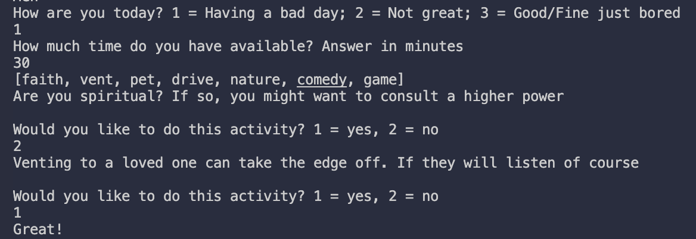

[](https://classroom.github.com/online_ide?assignment_repo_id=8066026&assignment_repo_type=AssignmentRepo)
# Moodtivity
 
Authors: [Binh Le](https://github.com/thabinhl21), [Garrett Greenup](https://github.com/garrettgreenup), [Yufeng Chen](https://github.com/Ychen1041), [Claudia Pascual](https://github.com/cpascx)
 

## Project Description
 * For our project, we decided to build an activity recommender based on an individual's mood and the amount of free time that they have. 
 * This is important to us because as college students, we can get stressed out from our schoolwork or experience other negative emotions. It would be helpful if we could be recommended different activities to do that can boost our mood. Also, it would be interesting to see how our moods changed over different days, as it can help us to identify any patterns.
 * We are using [Python](https://www.python.org/) for our backend and [TKinter](https://docs.python.org/3/library/tkinter.html), as well as the [Custom Tkinter library](https://github.com/TomSchimansky/CustomTkinter) to build the GUI for our project. Additionally, we used a [SQLite](https://www.sqlite.org/index.html) database to store user login info and information related to their moods and activities, and we also used [bcrypt](https://pypi.org/project/bcrypt/) to hash user's passwords for secure storage in our database.
 * The inputs of our project is the mood selected by the user from our mood scale, the date, and the amount of time they have available. Some more inputs are their username and password. These will be stored in the database, and specifically the password is hashed before getting stored. 
 * The outputs would be a list of questions that are asked to the user in order to narrow down their specific mood and the appropriate activities, the activity that is recommended to them based on the mood they selected and the amount of time they have available to complete an activity. Some more outputs would be if a user wasn't registered, then they will receive a message box telling them to register, or if their username/password is incorrect, they will receive a message box telling them their login is invalid.

 ## Final deliverable
 
 ## Screenshots
 
 
 
 
 
 
 
 
 
 
 
 
## Installation/Usage 
 Start off by creating a virtual environment and activating it by running the following:
 ```
 $ python3 -m venv .venv
 $ source .venv/bin/activate
 ```
 Then install the required modules by running:
 ```
 $ pip3 install -r requirements.txt
 ```
 Lastly, run the program with:
 ```
 $ python3 moodtivity.py
 ```
## How to use
 1. Register an account
 2. Login with your new account
 3. Select from the menu what you want to do. To input your mood, select the "Enter Mood" button
 4. To be recommended an activity, select the "Find Activity" button
## Testing
  We used Python's testing framework [unittest](https://docs.python.org/3/library/unittest.html) to test the functions for each of our classes. In some of the tests, we created mock objects and in all of the tests we used the assertEqual function.
 
